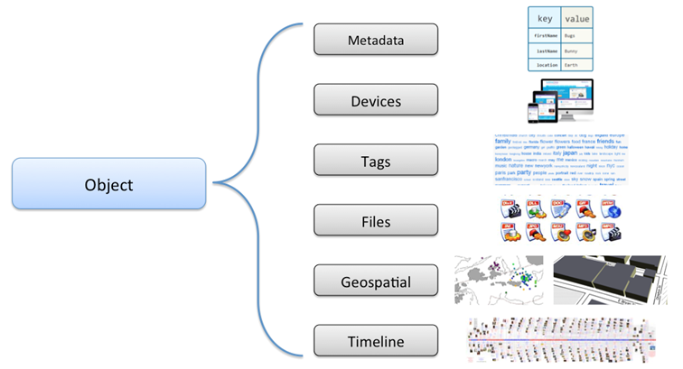
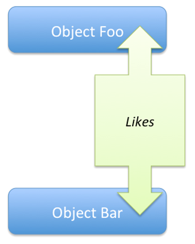
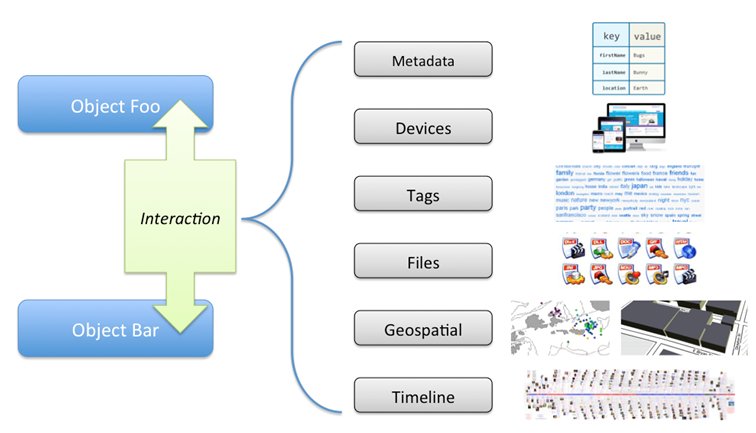

## The SnapBundle™ Hypothesis

* Every app captures context at some level
* Every app tries to capture metadata, tags, location data, timestamps, files, etc.
* Every app seemingly designs these same patterns _over, and over and over and over…_

**SnapBundle is a platform purposefully built to be an application's contextual data store.** It was designed as a platform; with minimal effort it can sit atop of other platform services you are already paying for, lowering the total cost of adoption.

## What is a _Context_ Data Store?
Every application captures context to some degree. There will always be application specific entities that don't map well into the SnapBundle platform. SnapBundle isn't intended to totally eliminate the need for your application to have some type of persistence layer. It is, however, intended to compliment that layer by offering *context services*. So how does SnapBundle define context?

Context starts the notion of a *thing*. This could be any noun-- think person, place, or (sorry) thing. Every *thing* in your system can be described using various types of *characteristics*. These characteristics may be simple, like eye color is blue or shape is square, or they may be more advanced, such as a 3D model of a building. Context changes over time, so every contextual model must consider both *space and time* (adding that 4th dimension to the mix). Finally, context must include the concepts of *relationship* and *interaction*. For example, a person Jason may have a relationship with Foo Bank, and he interacts with the bank everytime he makes a deposit or withdrawl. 

A few final noteworthy comments about context. First, relationships are binary in nature; true or false. Either Jason has an account with Foo Bank, or he doesn't. There is no inbetween or ambiguity. Second, interactions operate using a "0, 1, or many" cardinality. Finally, the notion of a relationship isn't restricted to the traditional "is-a" or "has-a" concepts defined by the semantic web. Verbs are valid relationships! *Jason "likes" Meredith* and *Jason "worked on" Air Conditioner* are both valid relationships. 

## How SnapBundle Models Context
### Objects
The contextual *thing* we talked about above is simply referred to as an *Object* in SnapBundle. Every Object can be fully described using the SnapBundle platform. Take a look at this graphic:

  
An Object can use the type-safe key-value pairs of *metadata* to describe characteristics. It can have a relationship with one or more geospatial definitions, built using the open [GeoJSON 1.0 Specification](http://geojson.org "GeoJSON Web Site"). 

Today's world has rapidly become smart device driven. Smartphones, tablets, laptops, and even specialized fashion accessories like Google Glass and smart watches are both fashion statements and the norm. Every *devices* in SnapBundle is a first-class citizen, and possession of a device can be linked to an Object. *Joe "borrowed" iPad* and *Sam "owns" iWatch* are legitimate device relationships with an Object.

An Object may be assigned any number of *tags*. Tags are like categories, but they are intended to be much more specific. In the blog world, for example, tags are used to create a mini index into a specific blog posting. In contrast, blog categories tend to represent a table of contents. Tags are also (typically) intended to be used as they are in Twitter, Facebook, and other social media applications.

An Object may be responsible for producing any number of *files*, including pictures, videos, documents, presentations, manuals, etc. 

Depending on the type of Object, it may have a *geospatial* relationship that precisely defines the perimeter of a building, it could represent a "check-in" at a common location, or it could represent the complete path, including stops, if the Object happens to be a delivery driver.

Capturing chronological sequencing is import when dealing with context. Did the Object do A or B first? A *timeline* provides a means to capture the chronological history of an Object.

### Relationships
Relationships are a critical component in understanding context. Relationships in SnapBundle are binary in nature, true or false, exists or do not exist. 
 

Modeling relationships with snap bundle is not restricted to the traditional "is-a" or "has-a" concepts commonly associated with the semantic web. Relationships may be action verbs to indicate a higher order relationship between two objects. Relationships in SnapBundle are not transitive per se. If a object Foo likes object Bar, that doesn't imply that Bar likes Foo. In order to capture the transitive nature, a second reciprocal relationship would have to explicitly be defined.

### Interactions
Unlike relationships that are meant to captures a binary existence, an interaction maintains a higher cardinality; they are intended to be singular or recurring events.

Interactions share the same set of descriptive capabilities found on an Object, as depicted below.

Check out our [primary data types](DATA_TYPES.md "Primary Data Types") to see our incredibly intuitive object model.

### A Contextual Illustration
Consider the following arbitrary example. Jason, a person, is represented as an Object in the system. He has metadata that describes his stature, files that contain pictures of him, etc. 

Jeep Rubicon, a vehicle, is also represent as an Object in the system. It has metadata that describe the vehicle, like color = black. It also has a geospatial representation associated with it the accurately defines the perimeter of the vehicle, like its wheel base, height, width, etc. 

There is a relationship captures that indicates that Jason "owns" Jeep Rubicon.

A series of interactions are captured to represent each time that Jason drove the Jeep Rubicon. Each interaction captures a geospatial object that represents the physical route that Jason followed while driving the vehicle. Since Jason made 3 stops while he was out, those stops are captured with the timeline. During the drive, Jason had a flat tire, so there is a tag "#flat" associated with that interaction. He also filled up with gas before returning home, so another tag "#fillup" is noted.

# What SnapBundle Isn't
## It's About Persistence
As you can see, SnapBundle can easily associate virtually _anything_ with _anything_. Hashtags, key-value metadata, and arbitrary files of any type or size are easily associated with an Object or other top level entities. Data is securely stored in the Cloud. SnapBundle can capture innate relationships like parent-child, peer and neighbor, and it can equally capture actions by or between objects.

## It's not an Analytical Engine
The platform wasn't built to perform Big Data analytics- it was meant to store the data that can be fed into a Big Data analytics system. It's a subtle difference that shouldn't be quickly dismissed. There are dozens, if not hundreds of analytical and expert systems on the market today. Ask yourself this simple question:

*Where are you going to store the authoritative copy of your raw underlining data?*

If you are searching for a solution to free you from storing your data in a proprietary system, possibly creating some type of "vendor lock-in," then SnapBundle is what you are looking for. Using Web Services and JSON, push your authoritative records to SnapBundle. Wire up SnapBundle to your current preferred analytics engine. Interested in seeing what this new expert system can do with your data? Then wire up SnapBundle to push data into that system and give it try. 

## Other Noteworthy Features

### Near Real-Time Integration
We get it- *you* generated the data, *you* want to own the data, and, you want us to push it "over here" in a timely manner. That's exactly what the SnapBundle platform can do. Today the platform can push data to any HTTPS end point. As soon as we digitally sign and persist the data we just received, we'll push a copy of that data to you using JavaScript Object Notation (JSON) as fast as the ether will carry the bits. Check out our [Event Stream](EVENT.md "Event Stream") model to see how easy it is to understand the data feed.

### Extension Architecture
The SnapBundle platform was designed from scratch with a plugin model; we call them *extensions*. Remember how we said that we aren't an analytical engine? We aren't, but maybe you are. Use any modern language- Python, Ruby, Java, .NET, or anything that can talk to us using HTTP and JSON. We built our authorization model around the [OAuth 2.0 Specification (RFC 6749)](http://tools.ietf.org/html/rfc6749 "OAuth 2.0 Specification"), and data owners can grant you read or write access in a very granular fashion.

Ready to learn more?

## Table of Contents
* Chapter 1: Platform Overview
  * [Getting Started](GETTING_STARTED.md "Getting Started")
  * [Registration](REGISTRATION.md "Registering for an SnapBundle™ Account")
  * [Quick Setup via **cURL**](SAMPLE_SETUP_SCRIPT.md "Sample Setup Script")
  * [Idea Book: _What kinds of things can the SnapBundle™ Platform do?_](IDEAS.md "Idea Book")
* Chapter 2: Object Model
  * [Primary Data Types](DATA_TYPES.md#primary "Data Type")
  * [Secondary Data Types](DATA_TYPES.md#secondary "Data Type")
* Chapter 3: Administrator Managed Objects
  * [Account](ACCOUNT.md "Account Management") 
  * [Users](USER.md "User Management")
  * [Devices](DEVICE.md "Device Management")
* Chapter 4: User Managed Objects
  *  [Objects](OBJECT.md "Object Management")
  *  [Object Addresses](OBJECT_ADDRESS.md "Object Address Management")
  *  [Object Interactions](OBJECT_INTERACTION.md "Object Interactions")
  *  [Object Interaction Sessions](OBJECT_INTERACTION_SESSION.md "Object Interaction Session")
  *  [Relationships](RELATIONSHIP.md "Relationship Management")
  *  [Files](FILE.md "File Management")
  *  [Tags](TAG.md "Tag Management")
  *  [Metadata](METADATA.md "Metadata Management")
  *  [Georectification](GEORECTIFICATION.md "Georectification Capabilities")
* Chapter 5: Searching and Reporting
  *  [Events: _Full Account Audit Loggig_](EVENT.md "Understanding Events")
* Chapter 6: Integration and Customization
  *  [Back Office Integration](INTEGRATION.md "Back Office Integration")
  *  [Extending the Platform](EXTENSION_FRAMEWORK.md "Extension Framework")
  *  [OAuth 2.0 AuthN and AuthZ](OAUTH_GUIDE.md "OAuth 2.0 with Extensions")
 
